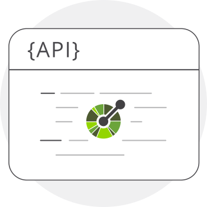
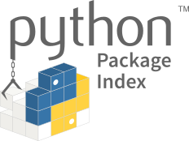

# ENACOM Python bootcamp

Processo completo de construção e utilização de uma API para resolver um problema de otimização.

## Definição da API com OpenAPI

[Explicação da especificação OpenAPI](https://oai.github.io/Documentation/specification.html)

Para visualizar a especificação como documentação dinâmica vamos usar o [editor do swagger](https://editor.swagger.io/)

## Definição das regras de negócio em testes de unidade com Pytest

## Estruturação dos dados iniciais em Python com Pydantic

## Envio de dados de entrada no formato JSON com Postman

## Modelagem de um problema de otimização

## Uso de métodos de otimização para resolução do problema
Usaremos a biblioteca desenvolvida pela ENACOM disponível no PyPI (The Python Package Index): [science-optimization](https://pypi.org/project/science-optimization/)

## Criação dos dados de saída em Python com Pydantic

## Recebimento dos dados de saída no formato JSON com Postman

