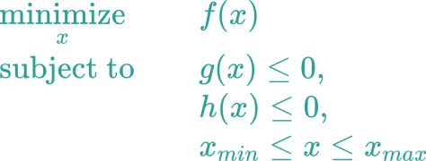
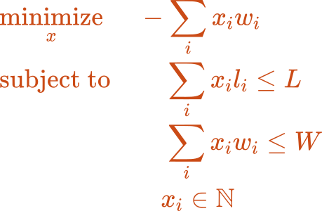

# ENACOM Python bootcamp

Processo completo de construção e utilização de uma API (Interface de programação de aplicações) para resolver um problema de otimização.


## 1. Definição da API com OpenAPI


[Explicação da especificação OpenAPI](https://oai.github.io/Documentation/specification.html)

Para visualizar a especificação como documentação dinâmica vamos usar o [editor do swagger](https://editor.swagger.io/)


## 2. Definição das regras de negócio em testes de unidade com Pytest


## 3. Estruturação dos dados iniciais em Python com Pydantic


## 4. Envio de dados de entrada no formato JSON com Postman


## 5. Uso de métodos de otimização para resolução do problema
Usaremos a biblioteca desenvolvida pela ENACOM disponível no PyPI (The Python Package Index): [science-optimization](https://pypi.org/project/science-optimization/).


Ela resolve problemas que apresentam a seguinte forma:



Achar o valor da variável de entrada **x** que gera o menor valor de saída **f(x)**, porém respeitando os limites **g(x) <= 0**, **h(x) <= 0**, para **x** dentro de um faixa de valores entre **x_min** e **x_max** inclusos.


## 6. Modelagem de um problema de otimização
### Problema: encontrar a alocação ótima dos modelos de trens

> **Objetivo:** maximizar a quantidade de vagões em trem.

> **Restrições:** disponibilidade de vagões e locomotivas.

### Modelo matemático do problema


* **i** é o índice do modelo de trem;
* **w_i** é a quantidade de vagões do modelo de trem **i**;
* **l_i** é a quantidade de locos do modelo de trem **i**;
* **W**  é a disponiblilidade de vagões;
* **L** é a disponiblilidade de locomotivas;
* **x_i** é a quantidade de trens alocados por modelo.

### Modelo computacional do problema

```py title="optimization/optimizer.py"
"""
Solver for optimization problem.
"""
def build_allocation_problem(
    wagons: np.ndarray,
    locomotives: np.ndarray,
    total_wagons: int,
    total_locomotives: int,
    verbose: bool = True
) -> OptimizationProblem:
    """
    Build a allocation optimization problem.

    Args:
        wagons (np.ndarray): Wagons for each train model.
        locomotives (np.ndarray): Locomotives for each train model.
        total_wagons (int): Total of available wagons.
        total_locomotives (int): Total of available locomotives.
        verbose (bool, optional): Show problem informations. Defaults to True.

    Raises:
        ValueError: Inconsistent problem when total of models is diffents
        for locomotives and wagons. Also inconsistent problem when or
        total of available wagons or locomotives are negatives.

    Returns:
        OptimizationProblem: structured optimization problem.
    """
    ...


def optimize_allocation(problem: OptimizationProblem) -> tuple[ndarray, ndarray]:
    """
    Solver a optimization allocation problem.

    Args:
        problem (OptimizationProblem): Structured optimization problem.

    Returns:
        tuple[ndarray, ndarray]: train_models end allocation.
    """
    ...
```


## 7. Criação dos dados de saída em Python com Pydantic


## 8. Recebimento dos dados de saída no formato JSON com Postman


## 9. Análise do resultado da otimização
